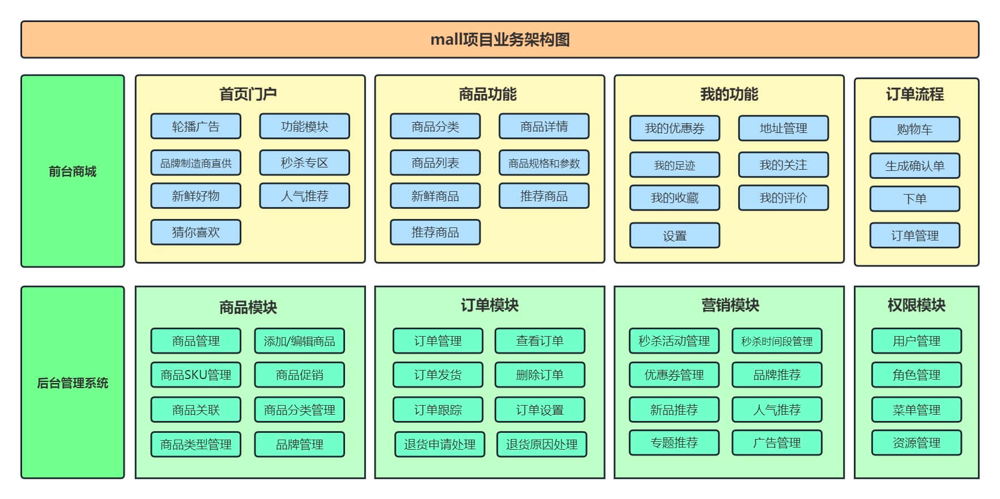

# B2B-B2C-mall
# 前言

致力于提供Java领域最优秀的自营商城解决方案。这个商城项目是团队在进行本地辅材商城创业时进行开发的，因为我们技术栈是Java，所以，整个平台是基于Java进行开发的。虽然没有其他平台丰富的集成。但是整个商城的扩展性和代码的质量都可以得到保证。我们本着分享的态度，将优质的Java商城解决方案通过收费开源的方式与大家共享。如果您感兴趣，可以联系我们 !

# 项目介绍

该项目是一套完整的B2B/B2C电商平台，包括H5（可转为小程序）、App、商城管理后台组成的系统，基于xxxx实现，采用xxxx部署。前台商城包括商城首页、商品搜索、商品展示和推荐、购物车、订单流程、会员中心、积分中心、支付中心等模块；后台管理系统包括商品库管理、订单管理、库存管理、广告管理、售后退款、权限管理等。项目已经拥有了商城核心的板块。各板块之间业务衔接紧密又预留了很好的扩展性，方便以后进行二次开发。

## 架构图

### 系统架构图

### 业务架构图

## 后台管理系统

## 前台商城系统

### 商品展示及推荐

### 下单流程

### 商品售后

### 用户个人中心

# 服务方式

1. 保证代码无任何加密。

2. 提供标准化产品上架资料申请和上架。

3. 所有B端运营资料提供、免费提供优质硬件供应商价格。

4. 可帮助搭建敏捷开发流程团队管理软件搭建及培训。

5. 售后30天、24小时客服。

# 联系方式

官网：www.hjy-yn.com

公众号：云匠智能

电话：17606964366
